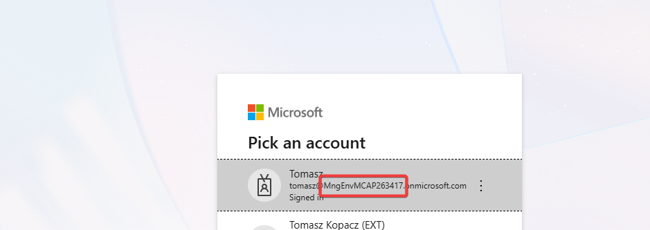
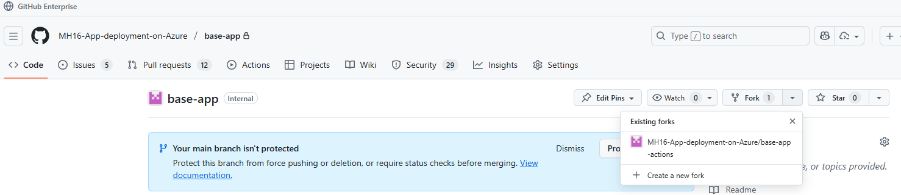
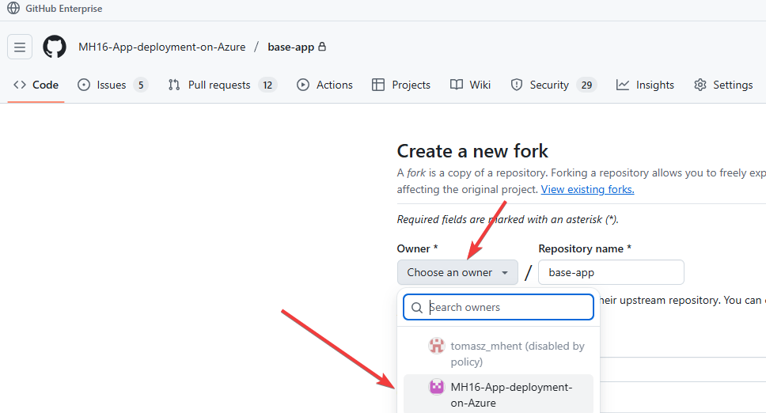
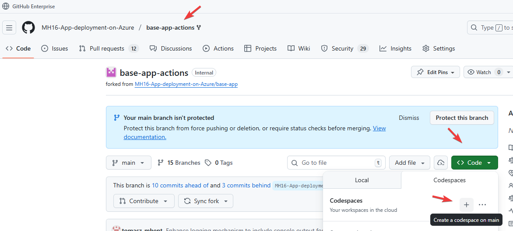
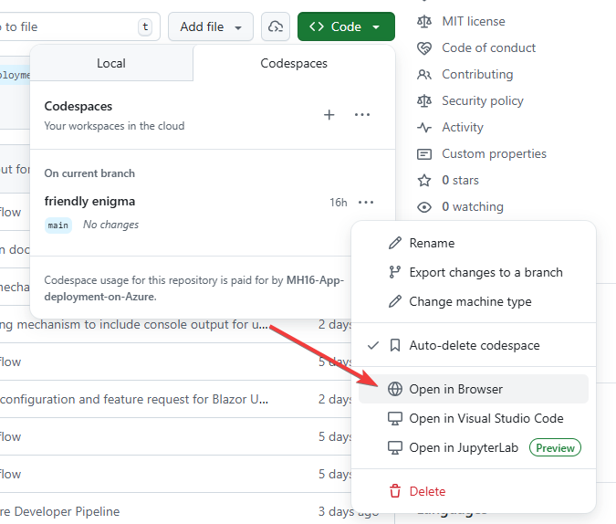
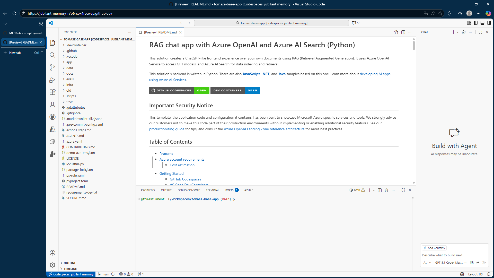

# Jak zacząć

## Login

Nowy WORK PROFILE

URL: https://github.com/enterprises/mhent

Potem: https://github.com/MH16-App-deployment-on-Azure

Tenant: MngEnvMCAP263417.onmicrosoft.com (i właściwy użytkownik)

(tenat ID): b9b9ed6c-c954-45a5-8579-af886f036194

## Fork projektu

Własny fork: https://github.com/MH16-App-deployment-on-Azure/base-app

Nazwa forka związana z nazwą konta, na przykład **login do tenatnu**-app, **chat-50-base-app**

## Uruchmić **CodeSpace** na własnym forku

(będziemy zmieniać kod - więc )

Pracujemy na gałęzi Main (wiem - powinny być gałęzie developerskie itp - ale - z uwagi na ograniczony czas...)

CodeSpace automatycznie pobierze kod źródłowy projektu

Uwaga! Zalecam by urhcoamiać CodeSpace VS Code  w przeglądarce - uniknie się problemów z kontami do Github, potem autoryzacją w Azure itp.
Niektóre ad-blocki przeszkadzają.

### Efekt

## (Shortcut - **nie** zalecane)

Każdy ma dostęp do: https://github.com/MH16-App-deployment-on-Azure/base-app-actions gdzie wszystkie kroki zostały wykonane.

