# GitHub Actions: szablon uruchomienia `azd pipeline config`

## Cel

Automatyzacja wdrazania projektu

## Warunki wstępne

- Pracujesz w GitHub Codespaces dla tego repozytorium.
- Własny fork repozytorium.
- EntraID - Application Developer
- Azure - contributor w resource group
- nazwa resource group do wdrozenia
- używamy raczej Sweden Central / West Europe
- subskrypcja to ME-MngEnvMCAP263417-edbartko-2 (589ff257-94b5-4699-bcdf-ce867938ac4d)


W Codespaces narzędzia są dostępne w kontenerze (m.in. `azd` i `az`). Jeśli chcesz to szybko sprawdzić:

```shell
azd version
az version
```

## Zaloguj się do Azure (z poziomu terminala w Codespaces):

```shell
azd auth login
```

Jeśli logowanie przez przeglądarkę nie zadziała lub zobaczysz komunikat o braku przeglądarki, użyj trybu device code:


(albo na wprost)

```shell
azd auth login --use-device-code
```

## Utwórz nowe środowisko azd (jedno na uczestnika/zespół):

```shell
azd env new
```

Nazwa środowiska to nazwa resource group.

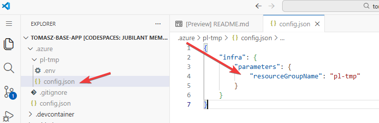

Dodanie właściwiej resource group 
Bez tego probowac bedzie stworzyc zasoby w subskrypcji
Bez tego powstanie resource group bazujaca na nazwie srodowiska

```shell
azd env set AZURE_RESOURCE_GROUP rg-azureclubworkshopchat-50
```

main.bicep
targetScope = 'resourceGroup'

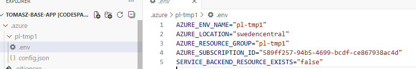

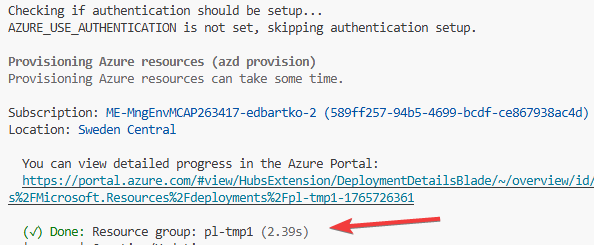

1. Uruchom jednorazowy deploy ręczny (wymagane przed pipeline):

```shell
azd up
```

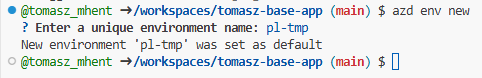

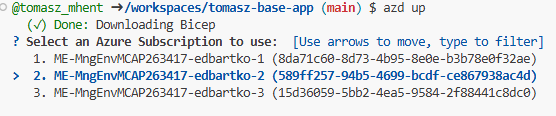

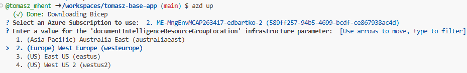


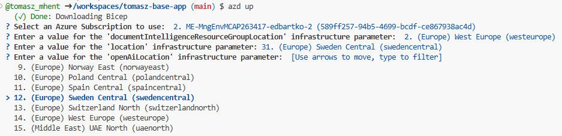

Efekt:

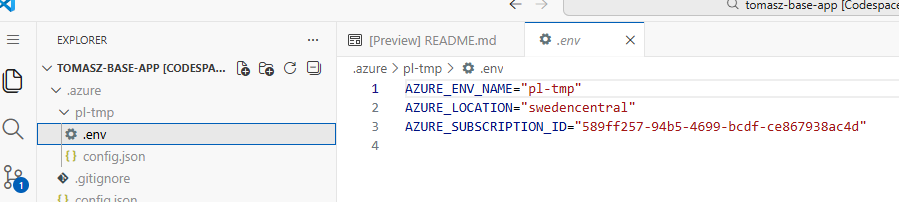

## (opcjonalnie) Uruchom lokalnie

```shell
@tomasz_mhent ➜ /workspaces/tomasz-base-app (main) $ chmod +x ./app/start.sh
@tomasz_mhent ➜ /workspaces/tomasz-base-app (main) $ ./app/start.sh
```

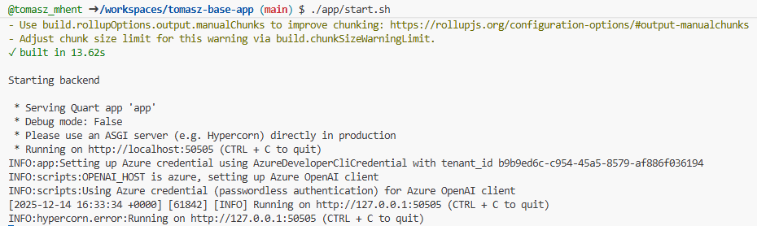

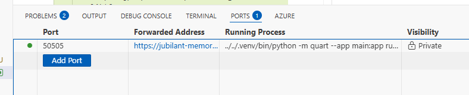

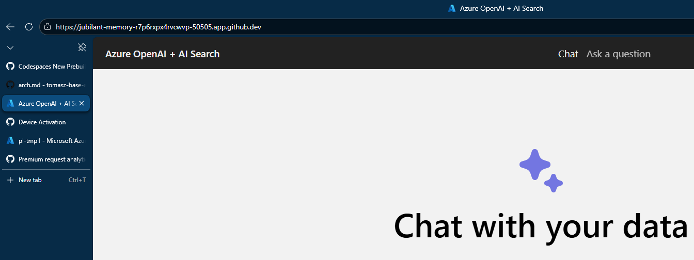 

## Skonfiguruj GitHub Actions przez `azd pipeline config`:

User Access Administrator

```shell
azd pipeline config
```

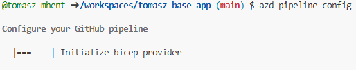

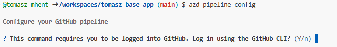

Bo jestesmy w nowym work profile
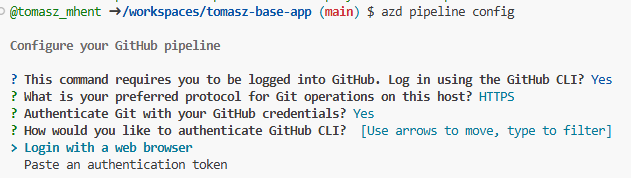


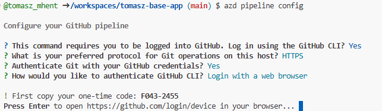

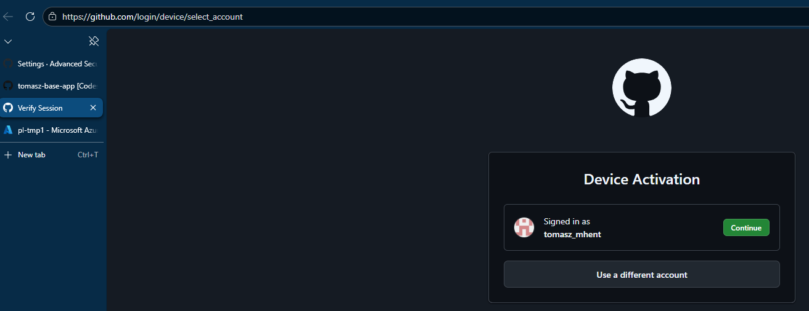 

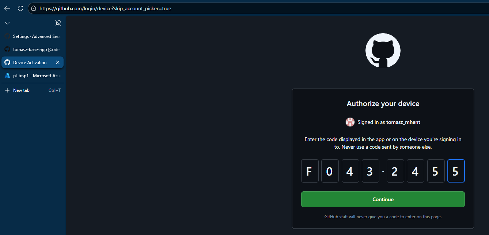

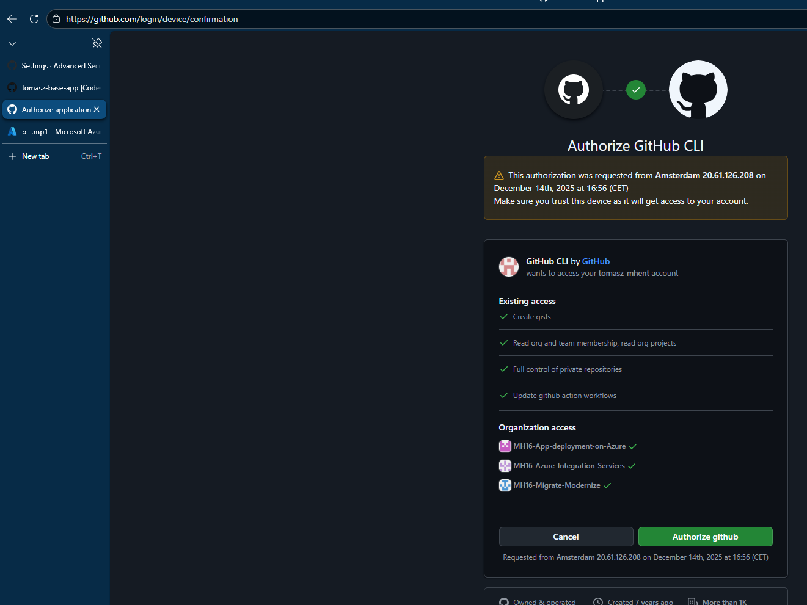

Wazne - 

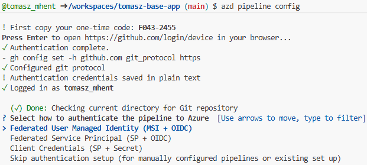

SP + OIDC

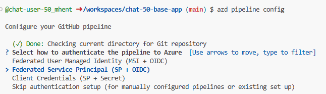

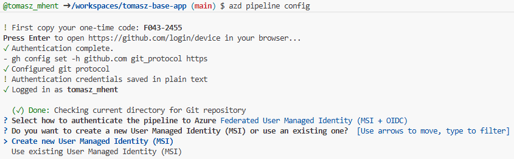

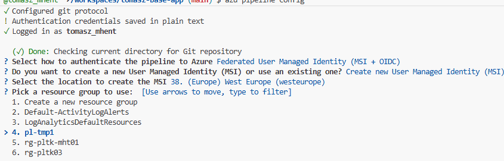


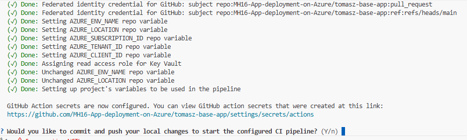


ENABLE WORKFLOW ON FORK

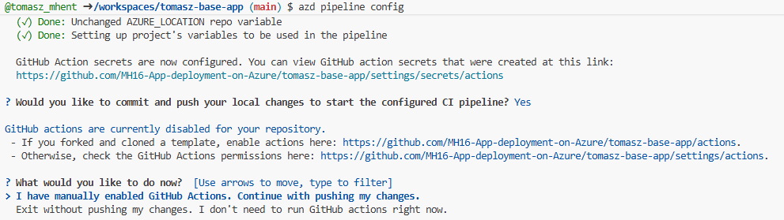

Ręcznie:

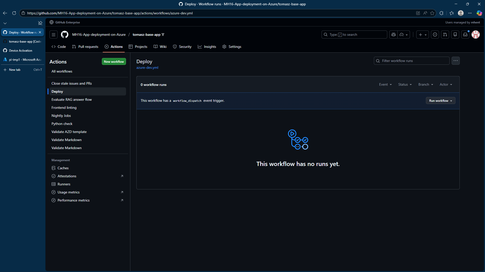

Ważny krok:

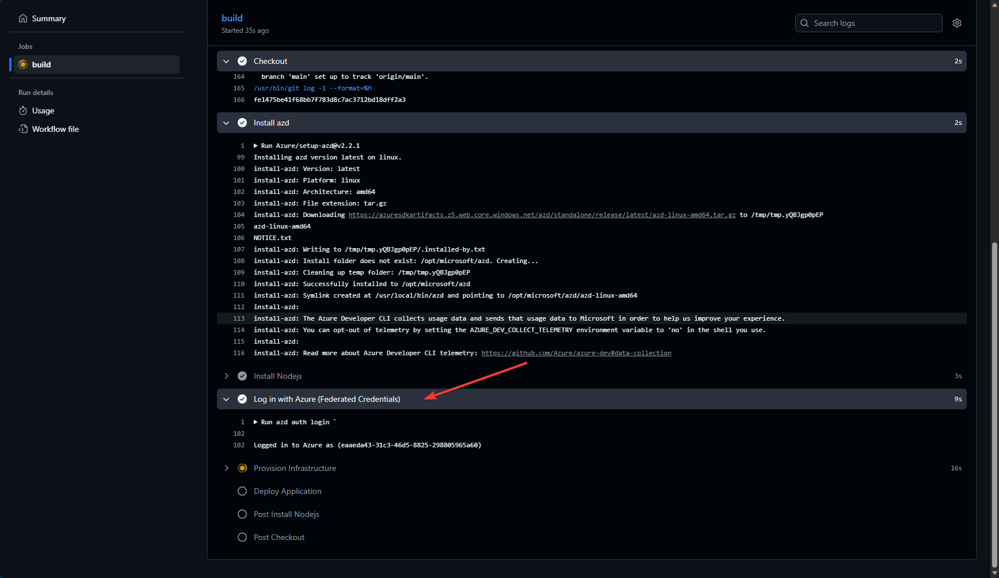 

(Analiza skryptu "wgrywającego" i logika azd - pipeline)

## Notatki

- Workflow jest już w repo w pliku `.github/workflows/azure-dev.yml` i używa głównie GitHub **Variables** (nie Secrets) do konfiguracji.
- `azd pipeline config` powinno być uruchamiane po `azd up`, bo wtedy `azd` ma komplet wartości środowiska do zapisania w repo.
- Jeżeli hackathon używa innej gałęzi niż `main`/`master`, dostosuj `on.push.branches` w workflow lub uruchamiaj go ręcznie.

