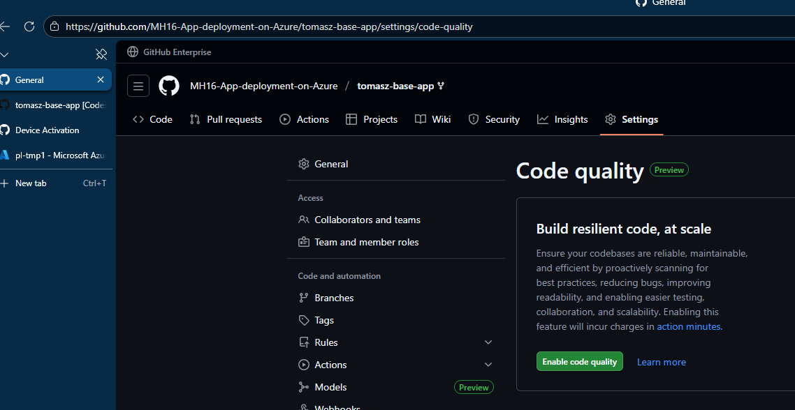
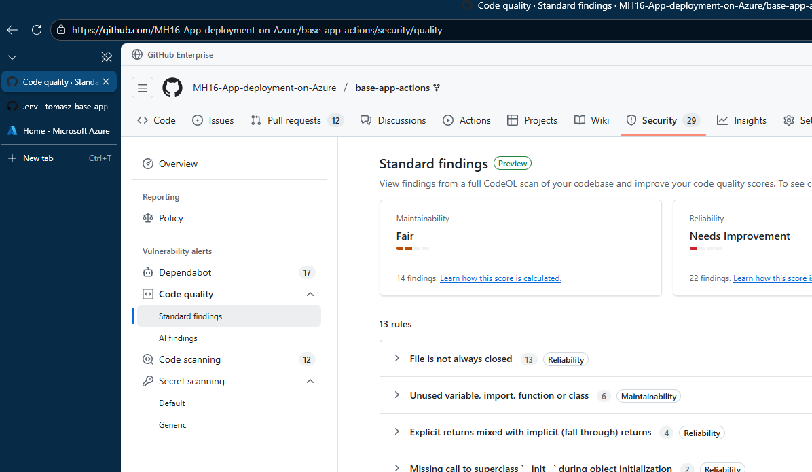

# Włączenie analizy rozwiązania

## Odblokowanie Advanced Security

Github:

Settings - Advanced Security

Enable: Secret Protection, Code Security, Dependency Graph

Ustawić akcje - do wy

## Odblokowanie Code Quality

Github:

Settings - Code Quality

## Trzeba poczekać - ale my idziemy dalej

(efekt)

