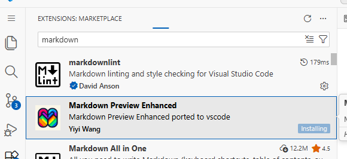
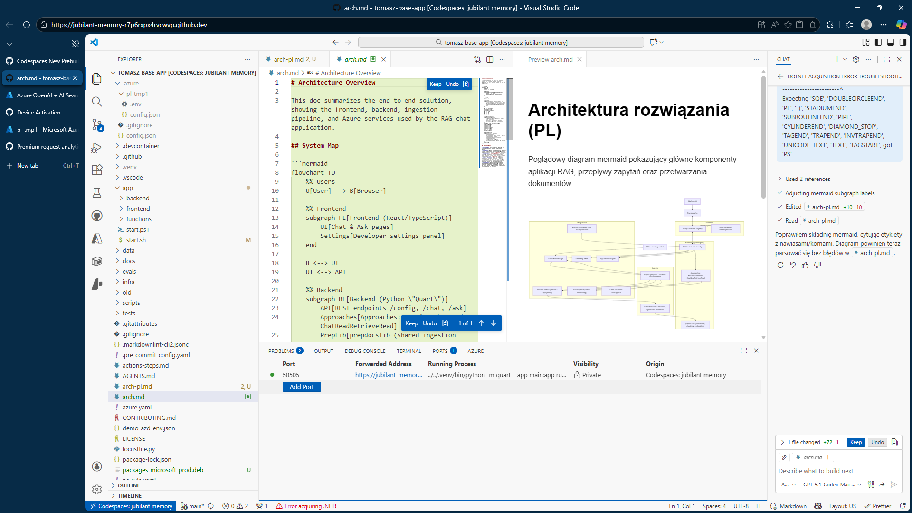

# Rozmowa z kodem

Może być w trybie "Ask" albo w trybie "Agent" albo puścić w "tle".

## Architektura

Wygeneruj diagram  arch-pl.md z diagramem w formacie  mermaid diagram dla całego rozwiązania. Chcę je zrozumieć lepiej. Nie używaj plików z folderu docs, a przeanalizuj cały kod źródłowy

(wkleic błąd jeżeli wystąpi - to jest LLM!)

Wygeneruj diagram  arch-pl.md z diagramem w formacie  mermaid diagram dla całego rozwiązania. Chcę je zrozumieć lepiej. Nie używaj plików z folderu docs, a przeanalizuj cały kod źródłowy

Porownac z:
Wygeneruj diagram  arch-pl-docs.md z diagramem w formacie  mermaid diagram dla całego rozwiązania. Chcę je zrozumieć lepiej.

## Opis plików

Wygeneruj plik backend-plik-pl.md zawierający dokumentację dla każdego (wszystkich) pliku źródłowego stanowiącego backend. Zapisz tam:
ścieżkę do pliku
króki (jednozdaniowy) opis za co plik odpowiada
długi paragraf opisujący działanie pliku
kazdą klasę i funkcję z jednozdaniowym opisem roli

## Jak działa algorytm generowania "chunków"

Powiedz mi jak są generowane chunki do bazy wektorowej?

Czy to jest robione online - czy batchowo, raz? I jak dodawane są nowe dokumenty?

## Gdzie się znajduje autoryzacja dla Entra ID i co trzeba zrobić by ją zaimplementować?

Gdzie się znajduje autoryzacja dla Entra ID i co trzeba zrobić by ją zaimplementować?
(4.1 TEZ dobrze dziala - i SZYBKO)
(Auto - tanie)

Jak działa ACL z Entra - i co trzeba zrobić by to włączyć? (na Auto!)

## Chcę dodać Content Safety - by sprawdzić czy odpowiedzi są właściwe.

Gdzie dodać Content safety do rozwiązania?

(hint - już dodane częściowo!)

Chciałbym żebyś powiedział gdzie dodać groundness check?

(hint - już częściowo!)