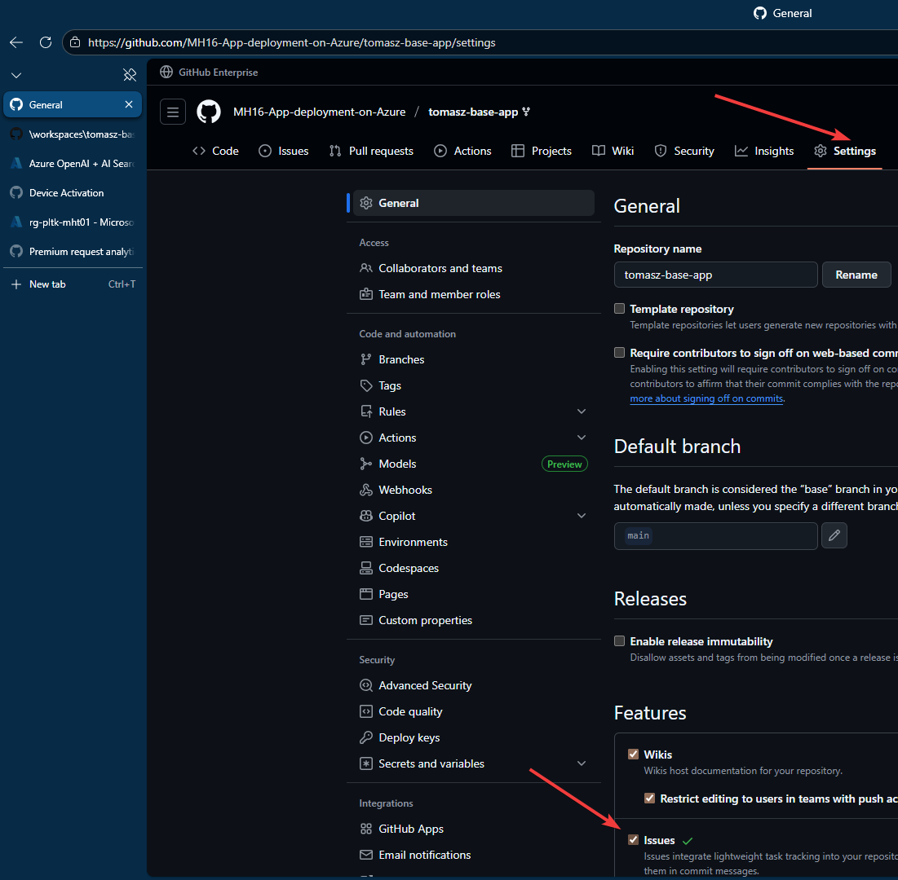
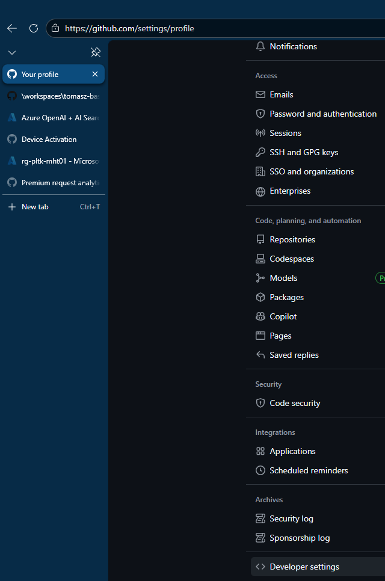
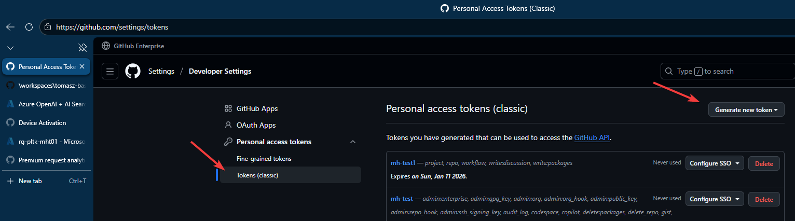

# Zlecenie Github Coding Agent zrobienia nowego UI

## Odblokować Issues w sforkowanym projekcie



## Rejestracja serwera MCP

Aby Github Copilot mógł zapisać "issue" w Github

### Wygenerowanie klucza PAT - potrzebny by MCP pracował w kontekście użytkownika

Na stronie: 
https://github.com/settings/profile ->Dev -> PAT

Uwaga! Skopiować PAT, a potem udzielić uprawnień do pracy w ramach ORGANIZACJI (tam jest nasze REPO)






### Dodanie mcp.json (lub wskazanie Github MCP Server z marketplace/extensions)

mcp.json:
```shell 
{
	"servers": {
		"io.github.github/github-mcp-server": {
			"type": "http",
			"url": "https://api.githubcopilot.com/mcp/",
			"headers": {
				"Authorization": "${input:Authorization}"
			},
			"gallery": "https://api.mcp.github.com",
			"version": "0.24.1"
		},
		"microsoft/playwright-mcp": {
			"type": "stdio",
			"command": "npx",
			"args": [
				"@playwright/mcp@latest"
			],
			"gallery": "https://api.mcp.github.com",
			"version": "0.0.1-seed"
		}
	},
	"inputs": [
		{
			"id": "Authorization",
			"type": "promptString",
			"description": "Authentication token (PAT or App token)",
			"password": true
		}
	]
}
```

### Użyć PAT i wystartować serwer

### Przykład polecenia:

using github mcp server create issue for building blazor ui for that application. As an additonal folder. Reuse the same backend, so add api on top of existing python app to be called from blazor app

Alternatywnie - jak MCP nie zadziała - dodać issue "ręcznie" i potem przypisać do niego Copilot:

### Poczekać (i potem zobaczyć efekt)