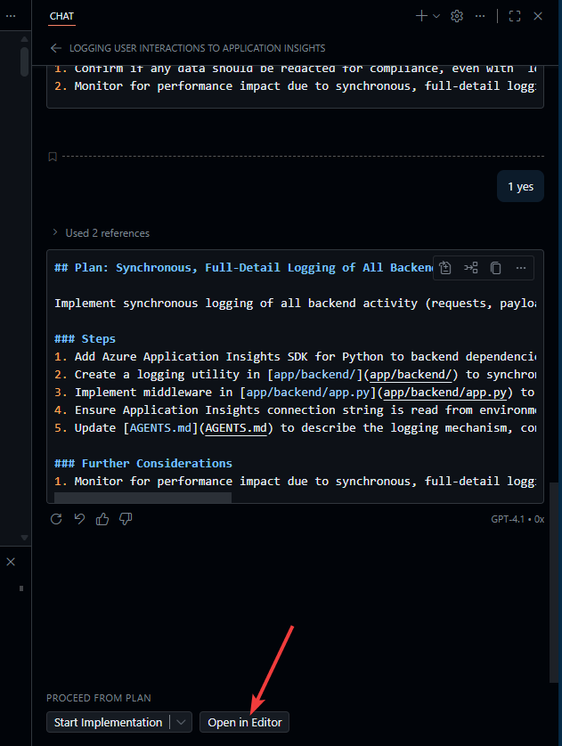
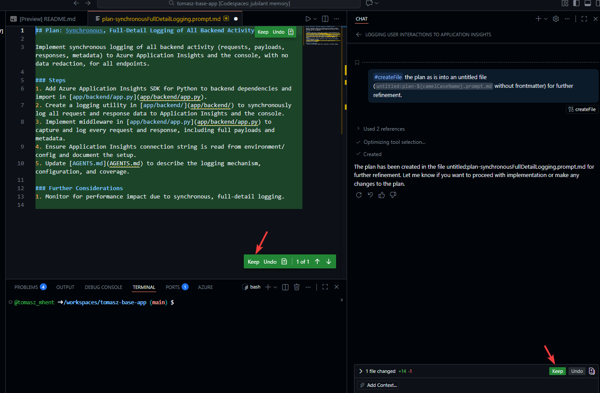
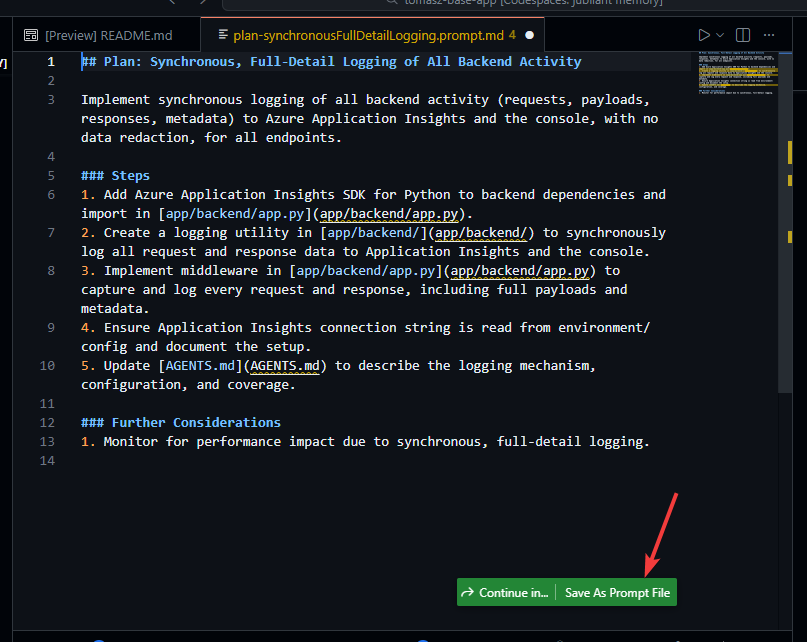
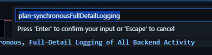
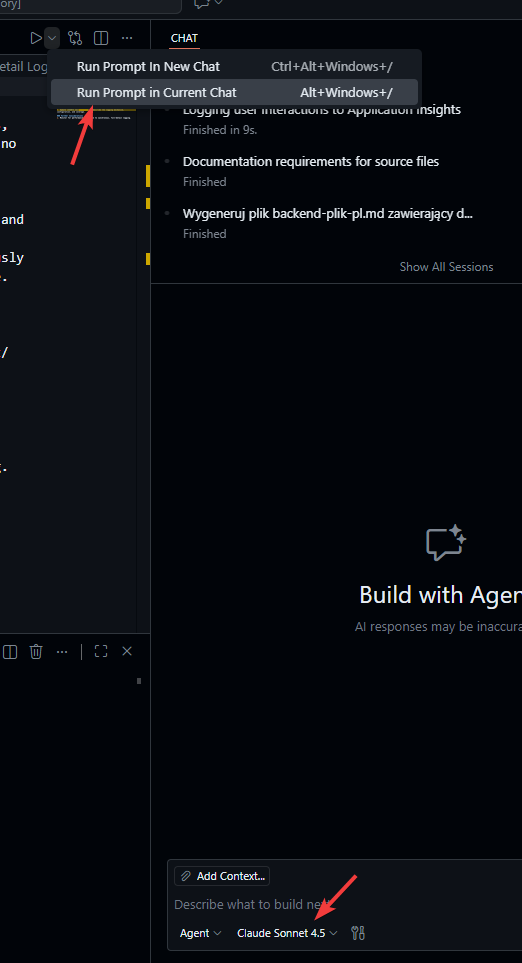

# Najpierw pomyśl, potem działaj

## Użycie trybu Plan w Github Copilot by zaplanować czynność a potem ją zlecić

### Pełne logowanie

Tryb Plan:
Dodaj do backendu aplikacji mechanizm który będzie logował zarówno pytania użytkowników jak i odpowiedzi do dołączonego Application Insight oraz zawsze wyprowadzał na konsoli. 

Zwrócić uwagę na rozmowę - i obiekcje Copilota!

(zapisać plan jako szablon promptu i potem wykonać )

Potem implement (na claude 4.5 lub nowszym)

### Uruchomić lokalnie i sprawdzić czy działa

### Commit do Github (by GH Actions skompilowało rozwiązanie)
