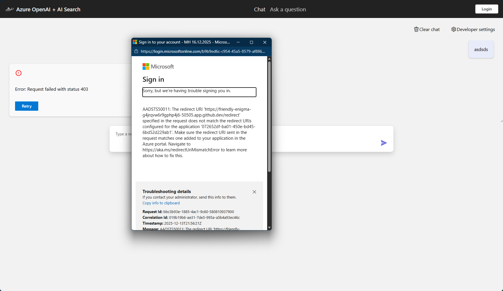
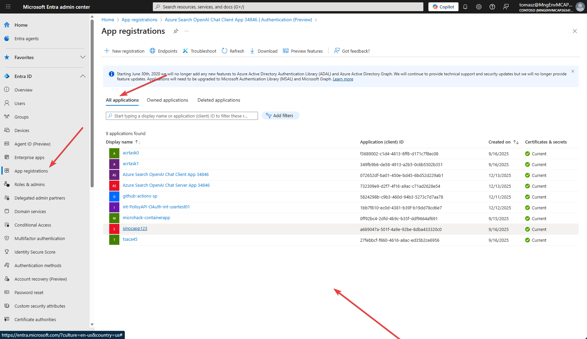
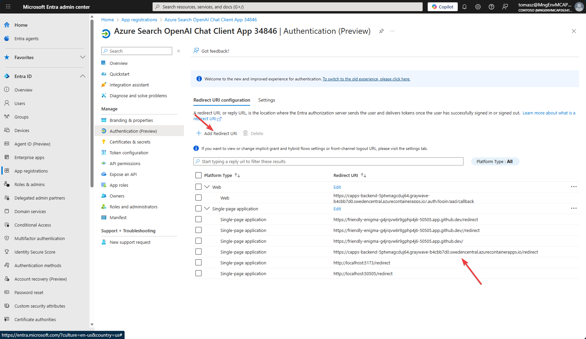

# Entra ID Login

Cel - logowanie kto używa chatbota, do czego i gdzie sięga
Opcja - ACL do dokumentów (skomplikowane)

Istotne: Uprawnienia w Azure: Twoje konto musi mieć uprawnienia do zarządzania aplikacjami w Microsoft Entra

Krok do zmiany środowiska
```sh
azd env set AZURE_USE_AUTHENTICATION true
azd env set AZURE_AUTH_TENANT_ID b9b9ed6c-c954-45a5-8579-af886f036194
```

Wykonać w Copilot:

```text
pokaz gdzie sa uzywane AZURE_USE_AUTHENTICATION i AZURE_AUTH_TENANT_ID
```

Zmiana konfiguracji - więc trzeba ponownie:

```shell
azd pipeline config
```

I wykonać commit / push

Jeżeli chcemy uruchomić rozwiązanie szybko (lokalnie) należy zmienić konfiguracje w Entra ID.

## (opcjonalnie) Uruchom lokalnie

```shell
@tomasz_mhent ➜ /workspaces/tomasz-base-app (main) $ chmod +x ./app/start.sh
@tomasz_mhent ➜ /workspaces/tomasz-base-app (main) $ ./app/start.sh
```
Błąd:



Dla danej ID aplikacji musimy dodać dodatkowy redirect

(Github CodeSpaces uruchamia serwer lokalnie i przekierowuje go na adres publiczny)

https://entra.microsoft.com/?culture=en-us&country=us#home

Szukamy Guid-a naszej aplikacji (rejestracja aplikacji):



I dodajemy URL dla naszego redirect (z CodeSpaces):




URL przypomina:
https://friendly-enigma-g4jrqvw6r9gphp4j6-50505.app.github.dev/**redirect**